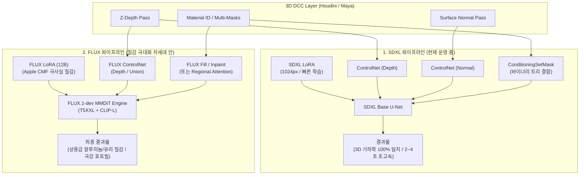
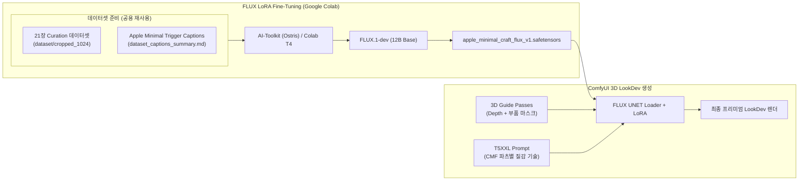
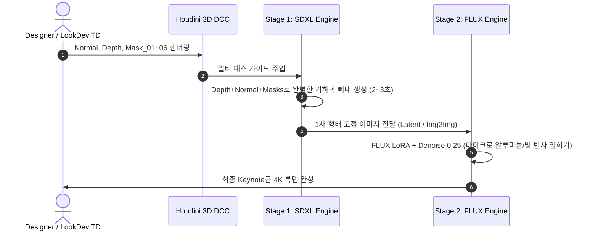

# 🍏 Apple Spatial LookDev Architecture: SDXL vs FLUX

이 문서는 **Apple Minimal Spatial LookDev Generation Pipeline**의 3D 공간 제어 구조와 SDXL vs FLUX 파이프라인의 차이점, 그리고 2-Stage 하이브리드 워크플로우를 시각화한 아키텍처 가이드입니다.

---

## 1. 파이프라인 구조 비교: SDXL vs FLUX

---

## 2. FLUX LoRA 학습 및 3D 공간 제어 엔드투엔드 구조

---

## 3. 실무 최강 조합: 2-Stage 하이브리드 워크플로우

---

## 4. 모델 아키텍처 및 특성 요약

| 비교 항목 | SDXL 파이프라인 | FLUX 파이프라인 |
| :--- | :--- | :--- |
| **모델 구조** | U-Net + Dual CLIP | 12B Flow Matching Transformer (MMDiT) + T5XXL |
| **3D Normal(법선) 제어** | ⭐⭐⭐⭐⭐ (완벽 & 1:1 일치) | ⭐⭐ (실험적 / 단일 패스 중심) |
| **3D Depth(깊이) 제어** | ⭐⭐⭐⭐⭐ | ⭐⭐⭐⭐ |
| **부품별 멀티 마스크 제어** | `ConditioningSetMask` 바이너리 트리 | `FLUX Fill` / Regional Attention |
| **재질 묘사력 (CMF & Light)** | ⭐⭐⭐⭐ (LoRA 보조 필요) | ⭐⭐⭐⭐⭐ (초미세 입자감, 포토릴) |
| **LoRA 학습 환경** | Colab 무료 T4 (10분) | Colab T4 / L4 (15~20분, FP8 최적화) |
| **추론 속도** | 장당 2~4초 | 장당 15~25초 |
