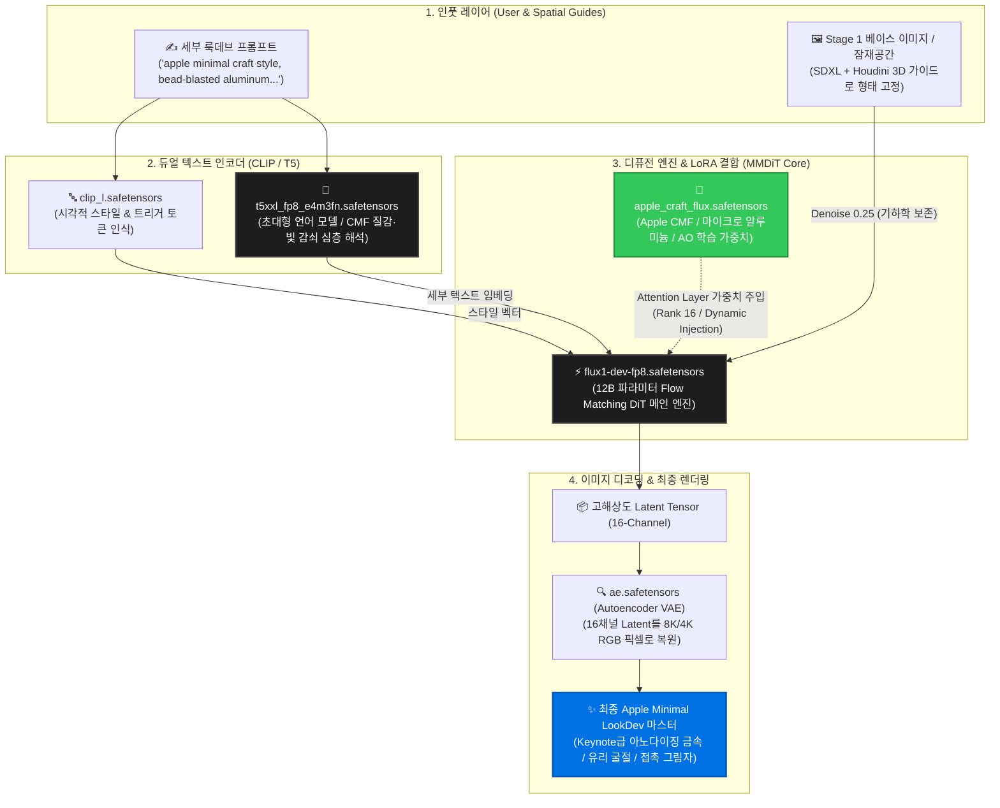

# 🍏 Spatial LookDev Pipeline: 2-Stage Hybrid Architecture
> **"From 3D Geometry to Apple-Grade LookDev in Seconds."**  
> 3D DCC의 정밀한 기하학 제어와 12B 파라미터 생성 AI의 극사실 질감 렌더링을 결합한 차세대 하이브리드 공간 룩데브 파이프라인.

---

## 1. Hero Section (헤드라인 & 핵심 가치)

### 📌 Main Headline
> **정밀한 3D 공간 제어와 극사실 CMF 룩데브의 완벽한 융합**

### 📌 Sub-headline
> 기존 렌더러의 긴 렌더 타임 없이, 순수 AI의 무작위 변형(Hallucination) 없이.  
> **Houdini의 3D 공간 가이드**, **SDXL의 기하학 락(Lock)**, 그리고 **FLUX.1-dev의 뉴럴 셰이더(Neural Shader)**로 완성되는 Keynote급 제품 룩데브.

---

## 2. 3-Step Pipeline Architecture (전체 3단계 요약)

```
[ Step 01. 3D Spatial Guides ] ────► [ Step 02. Geometric Base Lock ] ────► [ Step 03. Neural Beauty Pass ]
     Houdini Karma Passes                   SDXL Multi-ControlNet                 FLUX.1-dev + Apple LoRA
  (Depth + Normal + Multi-Masks)          (0% 기하학 왜곡 / 부품별 프롬프트)        (마이크로 알루미늄 / AO 라이팅)
```

- **Step 01. 3D Spatial Conditioning (Houdini 3D DCC)**: CAD/3D 모델에서 Z-Depth, Surface Normal, 6종의 파츠별 마스크를 렌더링하여 1:1 공간 좌표를 고정합니다.
- **Step 02. Geometric & Regional Lock (SDXL Engine)**: 다중 ControlNet과 이진 트리(Binary Tree) 마스킹으로 0% 왜곡의 3D 뼈대와 부품별 색상/재질을 2~4초 만에 1차 렌더링합니다.
- **Step 03. Neural Beauty Pass & CMF LookDev (FLUX.1-dev Engine)**: 12B MMDiT와 Apple Craft LoRA를 통해 아노다이징 알루미늄 입자감, 챔퍼 하이라이트, 정밀 유리 반사를 최종 코팅합니다.

---

## 3. FLUX.1-dev 코어 파이프라인 다이어그램



---

## 4. 4대 핵심 파일 + LoRA의 유기적 역할

```
[ T5XXL (두뇌) ] ──► [ FLUX UNet + Apple LoRA (화가 + 마감재) ] ──► [ VAE (디스플레이 렌즈) ]
```

### 1️⃣ `t5xxl_fp8_e4m3fn.safetensors` — **심층 프롬프트 해석 엔진 (The Brain)**
- **역할**: 구글의 초대형 언어 모델 T5-XXL을 8비트(FP8)로 최적화한 텍스트 인코더.
- **기능**: "아노다이징된 스페이스 그레이 알루미늄의 비드블라스트 질감", "모서리 챔퍼의 미세 하이라이트" 같은 **길고 정교한 자연어 문장을 100% 이해**하여 디퓨전 엔진에 좌표를 제공합니다.

### 2️⃣ `clip_l.safetensors` — **시각적 스타일 키워드 인코더 (Style Classifier)**
- **역할**: OpenAI의 CLIP-ViT-L 인코더.
- **기능**: `apple minimal craft style`, `clean matte studio` 같은 핵심 트리거 키워드와 전체적인 씬 톤앤매너를 빠르게 잡아줍니다.

### 3️⃣ `flux1-dev-fp8.safetensors` — **12B 파라미터 Flow Matching DiT (The Painter)**
- **역할**: FLUX의 본체이자 120억 개의 파라미터를 가진 트랜스포머 기반 생성 코어.
- **기능**: 기존 SDXL(U-Net) 대비 압도적으로 정밀한 공간/빛 상호작용 계산 능력을 바탕으로 노이즈를 걷어내며 픽셀을 생성합니다.

### 4️⃣ `apple_craft_flux.safetensors` — **Apple CMF 전용 LoRA (The Material Finish)**
- **역할**: 21장의 고품질 룩데브 데이터로 파인튜닝된 전용 재질 가중치.
- **기능**: FLUX DiT 내부의 어텐션 블록에 주입되어, 일반적인 3D 렌더링에 **Apple 특유의 무광 금속 입자, 부드러운 스튜디오 AO 그림자, 정밀 유리 반사**를 코팅하듯 입힙니다.

### 5️⃣ `ae.safetensors` — **16채널 고해상도 VAE (The Optical Lens)**
- **역할**: 16개 채널을 가진 FLUX 전용 고정밀 오토인코더.
- **기능**: DiT가 수학적으로 계산한 고차원 잠재 공간(Latent)을 사람의 눈으로 볼 수 있는 **선명한 RGB 사진(PNG)**으로 복원합니다.

---

## 5. Why Hybrid? (비교 우위 & 핵심 가치)

| 비교 항목 | 전통적인 3D 렌더러 (Arnold/Redshift) | 일반 텍스트-투-이미지 AI (Midjourney 등) | **Spatial Gen Pipeline (본 파이프라인)** |
| :--- | :--- | :--- | :--- |
| **3D 형상 일치율** | 100% (완벽) | 10~30% (무작위 변형 발생) | **100% (3D Guide 1:1 락)** |
| **룩데브 생성 속도** | 프레임당 5~30분 | 장당 10~20초 | **장당 15초 내외 (초고속 탐색)** |
| **부품별 재질 변경** | 셰이더/텍스처 수동 세팅 필수 | 부분 제어 불가 | **마스크별 프롬프트로 즉각 전환** |
| **CMF 마이크로 디테일** | 고해상도 텍스처 맵 및 라이팅 튜닝 필요 | 인공적이고 뭉개짐 | **FLUX 12B 기반 극사실 재질 렌더링** |

---

## 6. Key Highlights (웹사이트 카드 UI용 3대 특장점)

1. **🔒 Zero Hallucination (기하학 무왜곡)**  
   Houdini에서 내보낸 법선(Normal)과 깊이(Depth) 맵을 통해 제품의 비례와 디테일이 단 1픽셀도 틀어지지 않습니다.
2. **🧩 Binary Regional Conditioning (부품별 완벽 격리)**  
   이진 트리 텐서 마스킹 기술로 최대 6개 이상의 부품에 각기 다른 질감과 컬러를 상호 간섭 없이 독립 부여합니다.
3. **✨ Apple Minimal CMF Shader (극사실 질감 재합성)**  
   단순 2D 필터가 아닌, 빛의 굴절과 금속 입자를 지능적으로 재해석하여 Apple 특유의 미니멀 룩앤필을 구현합니다.
